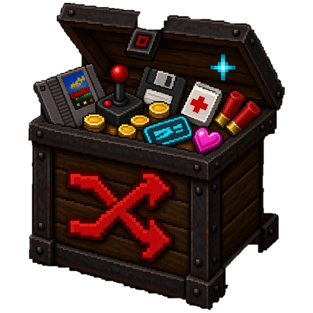
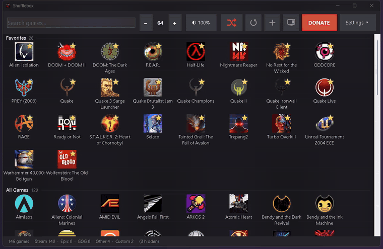
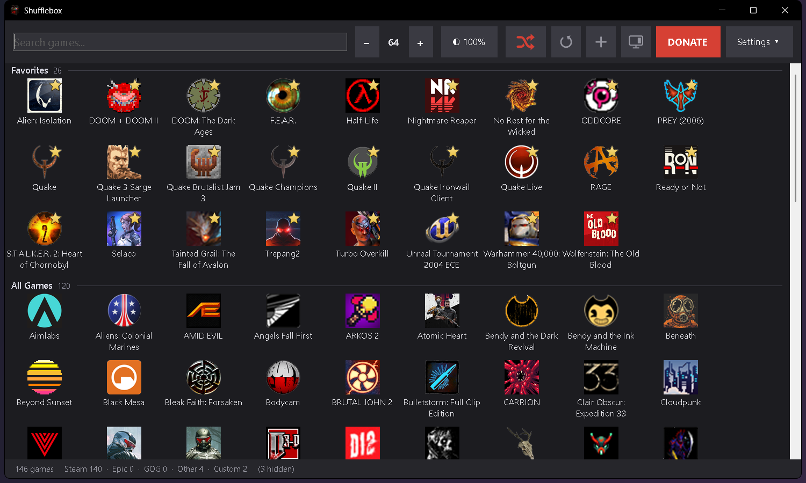
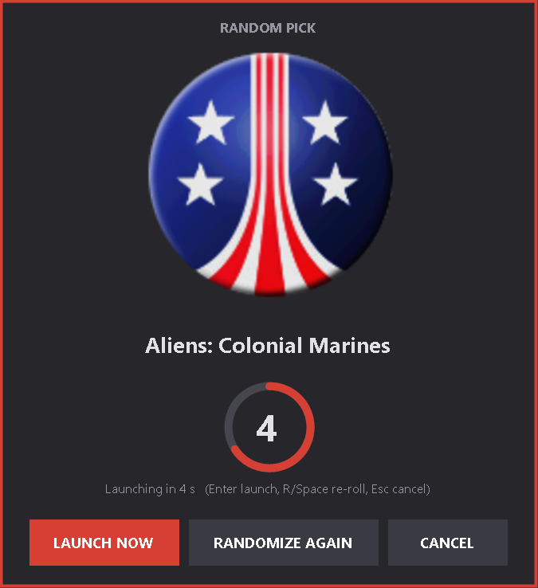
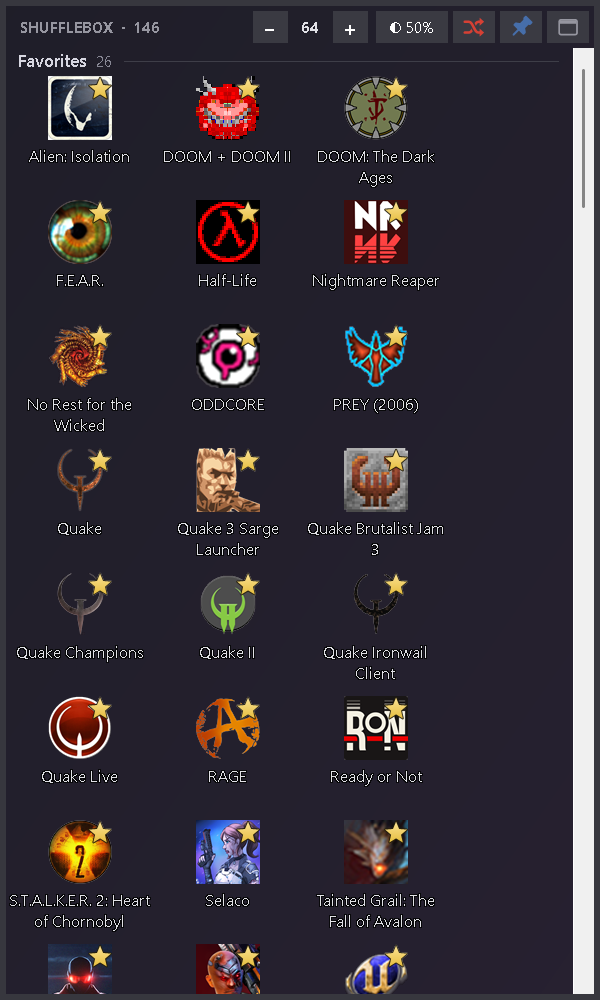
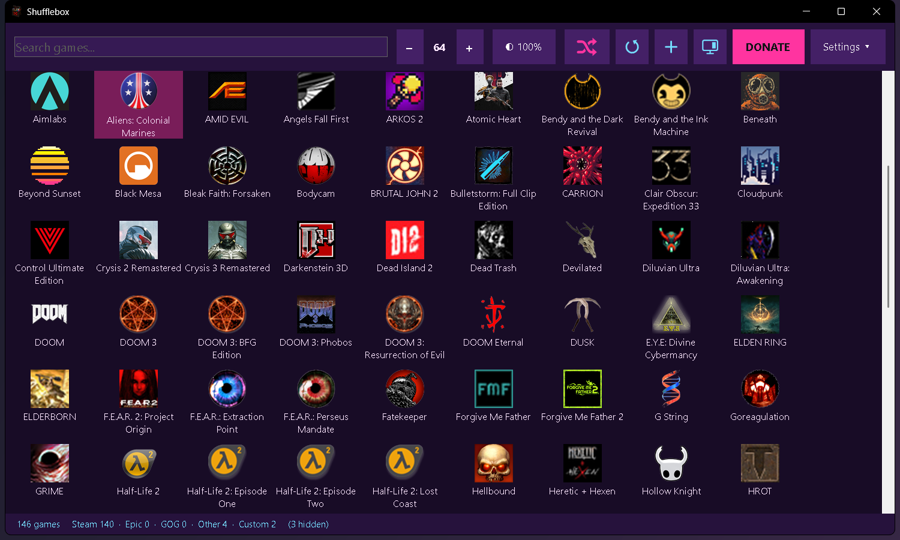
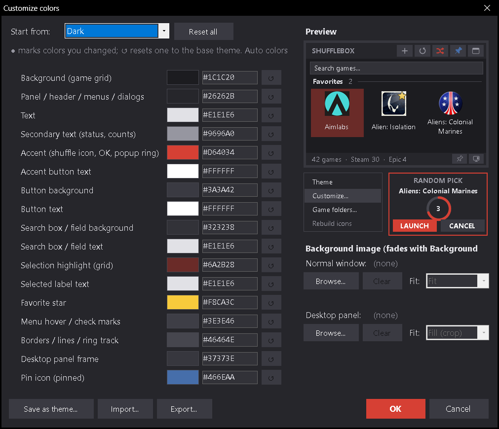

  

<h1 align="center">Shufflebox</h1>

<b>All your PC games in one place, plus a shuffle button for when you can't decide what to play.</b>

<b>🌐 Website: <a href="https://renegade-android.github.io/Shufflebox/">renegade-android.github.io/Shufflebox</a></b> · <a href="../../releases/latest">Download</a>

Shufflebox finds the games installed on your PC (Steam, Epic, GOG and non-Steam games) on every drive, shows them in a searchable grid with their real icons, and picks a random game for you. It can also sit on your desktop as a see-through panel.

## Screenshots

**Main window (Dark theme):** every game in one searchable grid, with favorites first.

**Random pick:** the shuffle button (crossing arrows) shuffles through your games, then counts down from 5 before launching the pick. Launch now, roll again or cancel.

**Desktop panel:** a borderless panel that stays behind your windows, here with a 50% see-through background.

**Themes:** seven built-in themes, for example Synthwave.

**Customize colors:** change any of the 17 color roles with a live preview, save your own themes, and add a background image.

Demo video (MP4, 54 s): [docs/media/shufflebox-demo.mp4](docs/media/shufflebox-demo.mp4). It is also attached to each [release](../../releases).

## Features

- **Finds your games automatically** on all fixed and USB drives: Steam (every library), Epic, GOG, and non-Steam games (Steam shortcuts, installed game publishers, Start Menu shortcuts, `\Games` folders and your own folders).
- **Real icons**: uses each game's Steam or exe icon (up to 256 px) and skips generic engine icons. You can set your own icon for any game.
- **Search**: start typing to filter. Enter launches the first match.
- **Favorites**: listed first, each with a star on its icon.
- **Shuffle** (crossing-arrows button): shuffles through your games, then shows a popup with a 5-second countdown. You can launch it now, roll again or cancel.
- **Desktop panel mode**: a borderless panel that stays behind your windows, with an adjustable see-through background (icons and names stay solid). You can pin it in place.
- **Themes**: Dark, Light, Midnight Blue, Doom Red, Quake Brown, Terminal Green, Synthwave, plus **full custom colors** (17 color roles with a live preview) and your own **background image** (Fill, Fit, Stretch, Center or Tile).
- **Icon size**: from 32 to 256 px. The normal window and the desktop panel each keep their own size.
- **Hide games** you don't want to see, and **add any exe** by hand.
- **Steam launch options are respected**: Steam games launch through Steam, so your launch options apply. They are also shown in each game's tooltip.
- **Start with Windows** (optional), in the normal window or desktop mode.
- One small portable exe. No installer and no account. It never changes game files.

## Download / Install

1. Download `Shufflebox.exe` from the [Releases](../../releases) page.
2. Put it in a folder of its own (for example `Documents\Shufflebox`), because it saves its settings next to the exe.
3. Run it.

Requirements: Windows 10 or 11. Uses .NET Framework 4.x, which is built into Windows, so nothing else needs to be installed.

## Quick start

1. On the first run Shufflebox scans your drives, which takes a few seconds. After that it starts instantly from its cache.
2. Double-click a game (or select it and press Enter) to launch it.
3. Press the **shuffle** button (crossing arrows) and let it pick.
4. Right-click a game for Favorites, Hide, Change icon and Open install folder.
5. Click the **monitor** button to turn it into a desktop panel. The **window** button in the panel header switches back, and the **pin** button pins or unpins the panel. Hover any icon button for its name.
6. Open **Settings ▾ > Theme** to change the look, or **Customize colors...** to choose every color yourself.

## Tips and shortcuts

| Action | How |
|---|---|
| Change icon size | Ctrl + mouse wheel over the grid, Ctrl + / Ctrl −, or the − / + buttons (Ctrl+0 = 64 px) |
| Search | Just type (Ctrl+F focuses the search box, Esc clears it) |
| Rescan for new games | F5 or the **circular-arrow** button |
| Random popup | **Enter** = launch now, **R** or **Space** = roll again, **Esc** = cancel |
| Background opacity | The **◐** button in the top bar or desktop panel header, 20–100% |
| Move or resize the desktop panel | Drag the header or edges (unpin it first) |

## Command-line switches

| Switch | What it does |
|---|---|
| `--desktop` | Start in desktop panel mode |
| `--set-startup desktop\|normal\|off` | Turn Start with Windows on (in that mode) or off |
| `--scan-report` | Scan, print a summary (also saved to `scan-report.txt`) and exit |
| `--rebuild-icons` | Re-resolve every icon and write `icon-report.txt` and `contact-sheet.png` |
| `--favorite <name>` / `--unfavorite <name>` | Add a game to or remove it from Favorites |
| `--launch-options [name]` | Print Steam launch options |
| `--test-random-popup` | Open the random popup with launching disabled (for testing) |

## Where data is stored

Everything is saved in the folder that holds `Shufflebox.exe` (portable):

| File | Contents |
|---|---|
| `settings.json` | Window position, mode, theme and colors, opacity, icon sizes, background image |
| `favorites.json` | Your favorites |
| `hidden.json` | Hidden games |
| `games.custom.json` | Games you added by hand |
| `icon-overrides.json` | Icons you picked yourself |
| `games.cache.json`, `icons\` | Scan results and the icon cache (safe to delete; they are rebuilt) |

Start with Windows uses `HKCU\Software\Microsoft\Windows\CurrentVersion\Run\Shufflebox`. To remove Shufflebox, turn that off and delete the folder.

## FAQ

**Windows SmartScreen says "Windows protected your PC".**
The exe isn't code-signed yet, so Windows doesn't recognize it. Click **More info > Run anyway**. Only download Shufflebox from this repository's Releases page.

**A game is missing.**
Press F5 to rescan. If the game is in an unusual folder, add that folder under **Settings ▾ > Game folders...**, or use the **+** button (Add a game) to pick its exe.

**Epic and GOG games?**
Epic games are found from the Epic Games Launcher's install records and launched through the Epic launcher. GOG games are found from GOG's registry entries and launched with their exe.

**Does it change my games or Steam settings?**
No. Shufflebox only reads them. Steam games are launched with `steam://rungameid/<id>`.

**I used it when it was called "Game Launcher".**
Put `Shufflebox.exe` in the same folder and your settings, favorites and icons carry over. Start with Windows moves to the new name automatically.

## Support / Donate

Shufflebox is free. If you enjoy it, donations are appreciated (honor system, nothing is tracked):

- **PayPal:** [Donate with PayPal](https://www.paypal.com/cgi-bin/webscr?cmd=_donations&business=shawnjwshackelford%40gmail.com&currency_code=USD)
- **Cash App:** [$renegadeandroid](https://cash.app/$renegadeandroid)

The **DONATE** button in the app opens the same links. Click *I donated, hide the Donate button* to hide it; **Settings ▾ > Donate...** is always there.

## License

**Freeware — see [LICENSE](LICENSE).** Shufflebox is free to download, use and share, as long as it is unmodified and free of charge. You may not sell it, bundle it into paid products, or modify or reverse engineer it. It is provided as is, with no warranty. Games, names, logos and icons shown in the app belong to their respective owners; Shufflebox is not affiliated with Steam, Epic, GOG or any publisher.

Copyright © 2026 Shawn Shackelford (RENEGADE ANDROiD).
